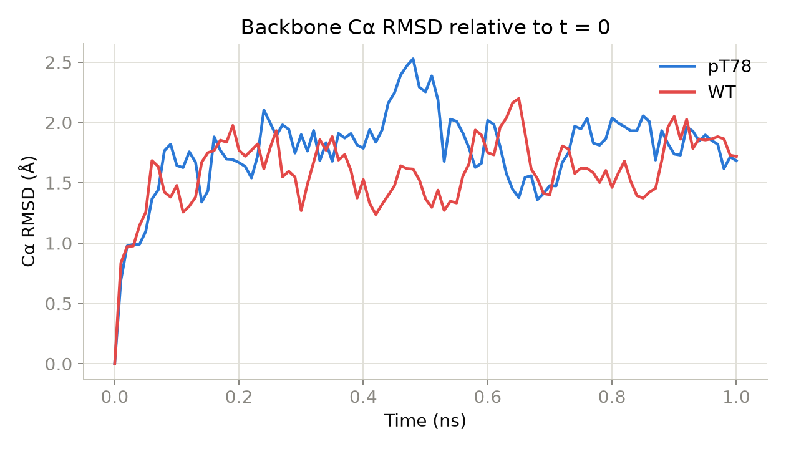
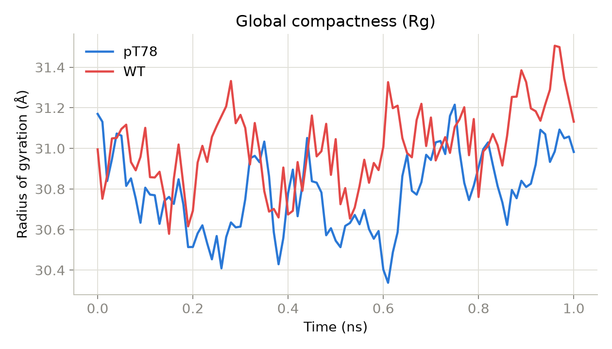
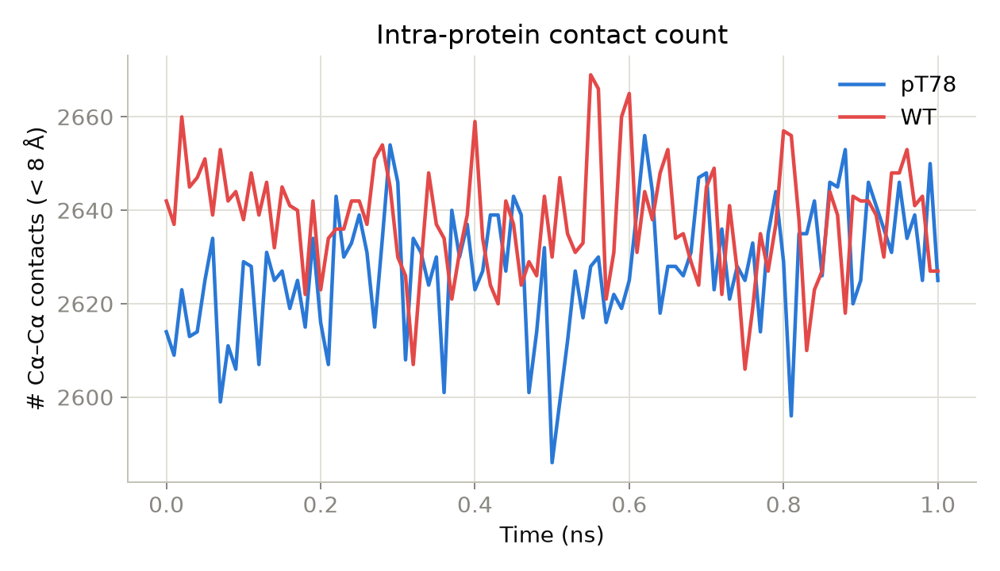
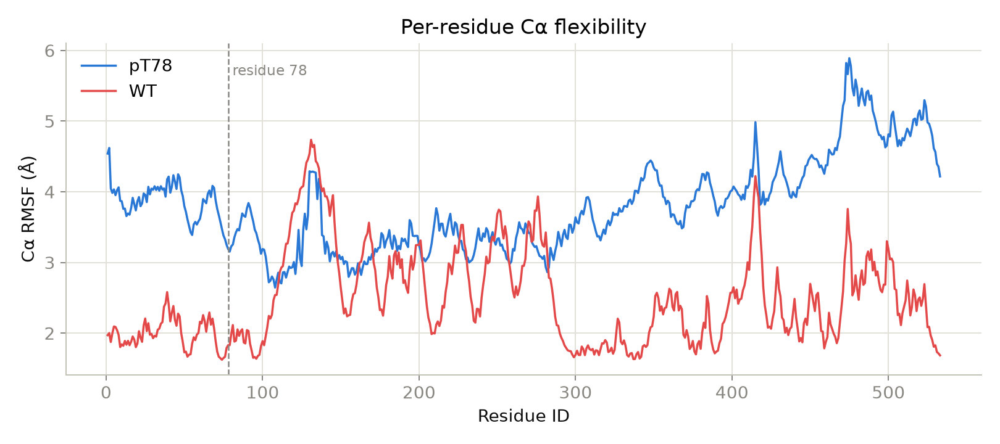
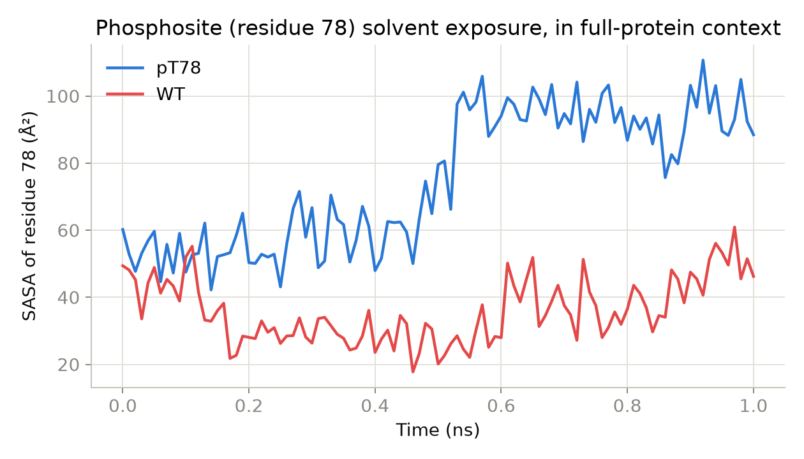
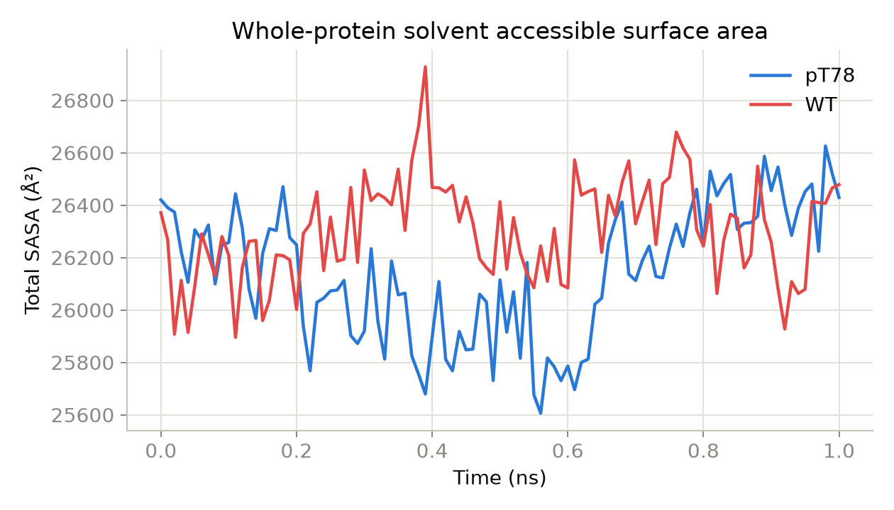
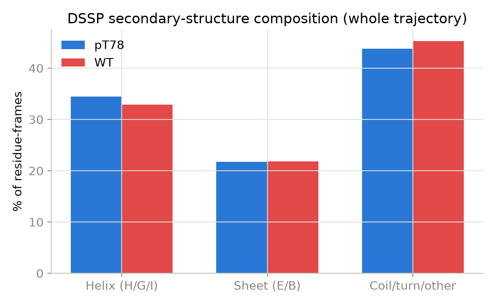

# Molecular Dynamics Analysis of Thr78 Phosphorylation in Human PHGDH: A Comparative Study of the pT78 and Wild-Type States

**System:** Human D-3-phosphoglycerate dehydrogenase (PHGDH), UniProt [O43175](https://www.uniprot.org/uniprotkb/O43175)
**Modification studied:** Phosphorylation of Thr78 (pThr78, chain A)
**Pipeline:** [`phosp`](https://github.com/qshao/Phosp) v.unreleased — CHARMM36m / GROMACS 2026.0

---

## Abstract

We performed all-atom, explicit-solvent molecular dynamics (MD) simulations of the
catalytic/regulatory domain-containing human PHGDH monomer in its unmodified
(wild-type, WT) state and with a phosphomimetic post-translational modification at
Thr78 (pT78), a residue whose CHARMM36m phosphothreonine (TPO) patch was applied
prior to solvation. Each system was equilibrated (500 ps NVT + 500 ps NPT) and
simulated for 1 ns of unrestrained production dynamics under identical protocol
settings (150 mM NaCl, TIP3P water, dodecahedral box, CHARMM36m force field).
Trajectory analysis — corrected for a periodic-boundary artifact detected during
post-processing (§2.4) — shows that phosphorylation of Thr78 produces a large,
localized increase in phosphosite solvent-accessible surface area (SASA 41.7 → 93.4
Ų, +124%, tail-window mean) without a corresponding change in whole-protein SASA,
radius of gyration, or global contact count. Per-residue flexibility (RMSF) is
elevated across most of the sequence in the pT78 run relative to WT, but the
elevation is not preferentially localized to the phosphosite, suggesting it more
likely reflects run-to-run sampling variation between two independent, short (1 ns),
non-replicated trajectories than a phosphorylation-specific rigidification or
loosening mechanism. We report these findings with the appropriate caveats for a
single-replicate, sub-nanosecond production window and outline what would be needed
to make the flexibility and stability claims statistically robust.

---

## 1. Introduction

PHGDH catalyzes the first, rate-limiting step of the serine synthesis pathway and is
frequently amplified or otherwise dysregulated in cancer. Thr78 is a predicted
phosphorylation site (NetPhos) situated in an N-terminal loop region. Phosphorylation
at surface-proximal threonine/serine residues commonly acts as a local conformational
switch — increasing local solvent exposure, altering nearby loop dynamics, or
modulating a nearby binding interface — without necessarily perturbing global fold
stability. This study asks three questions of the pT78 modification, using
back-to-back, protocol-matched MD runs of the phosphorylated and wild-type protein:

1. Does phosphorylation locally expose or bury the modified residue?
2. Does the modification perturb local backbone flexibility near residue 78, or
   protein-wide flexibility?
3. Does the modification destabilize the global fold (compactness, contact network,
   secondary structure content) over the accessible simulation timescale?

---

## 2. Methods

### 2.1 System preparation

Both systems were built from the same AlphaFold model (UniProt O43175) via the
`phosp` pipeline: Stage 1 applied the CHARMM36m pThr (TPO) patch at residue 78 for
the pT78 system, while the WT system skipped this step and used the protonated
structure as-is. Both were parameterized with the **CHARMM36m** force field,
solvated with **TIP3P** water in a **dodecahedral** box (≥1.0 nm protein-to-edge),
and neutralized/ionized to **150 mM NaCl**.

| Property | pT78 | WT |
|---|---:|---:|
| Total atoms | 189,313 | 189,314 |
| Protein atoms (incl. modified residue) | 8,035 | 8,031 |
| Water molecules | 60,308 | 60,310 |
| Na⁺ / Cl⁻ | 179 / 175 | 178 / 175 |
| Box edge (dodecahedron, nm) | 13.80 | 13.79 |
| Residue 78 identity | TPO (phosphothreonine) | THR |

The extra Na⁺ ion in the pT78 system is consistent with the −2 formal charge
introduced by the phosphate group at residue 78 requiring one additional
counter-ion for charge neutralization relative to WT.

### 2.2 Simulation protocol

Identical for both systems (`protocol: globular_protein`):

| Phase | Integrator | Length | Thermostat / Barostat |
|---|---|---:|---|
| Minimization | steepest descent | ≤50,000 steps | — |
| NVT equilibration | leap-frog, 2 fs | 500 ps | V-rescale |
| NPT equilibration | leap-frog, 2 fs | 500 ps | V-rescale / Parrinello–Rahman (isotropic) |
| Production | leap-frog, 2 fs | **1.0 ns** | V-rescale / Parrinello–Rahman |

Production frames were written every 10 ps (101 frames per trajectory, including
t = 0). Simulations were run locally with GROMACS 2026.0-conda_forge
(ARM_NEON_ASIMD SIMD, OpenCL GPU support present but not exercised on this CPU-only
host) via the `phosp` local runner. Wall-clock time for the production phase was
13.3 h (pT78) and 12.1 h (WT).

### 2.3 Analysis methods

Trajectories were re-analyzed directly from `production.gro`/`production.xtc` with
MDAnalysis 2.x and `freesasa`, using selections matched between systems:

- **RMSD** — Cα atoms, least-squares superposed onto the t = 0 frame.
- **RMSF** — per-residue Cα fluctuation about the time-averaged structure.
- **Radius of gyration (Rg)** — mass-weighted, whole protein (residues 1–533).
- **Contacts** — count of Cα–Cα pairs within 8 Å, periodic-image-aware.
- **Secondary structure** — DSSP (via `MDAnalysis.analysis.dssp`), grouped into
  helix (H/G/I), sheet (E/B), and coil/turn/other (–/T/S).
- **SASA** — Shrake–Rupley (`freesasa`, default classifier with a 1.5 Å fallback
  radius for unrecognized atoms), computed for the **whole protein including the
  modified residue**, with residue 78's contribution read from freesasa's
  per-residue decomposition. This gives an in-context (shielded) SASA for the
  phosphosite, rather than the SASA of residue 78 calculated in isolation.
- **Hydrogen bonds** — `MDAnalysis.analysis.hydrogenbonds.HydrogenBondAnalysis`
  between protein atoms (see Limitations — this returned zero bonds for both
  systems and is not reported further).

### 2.4 Data-consistency corrections (methodological note)

Two issues were identified and corrected before producing the results below; both
are disclosed here for transparency and reproducibility.

**(a) Periodic boundary artifact.** The raw `production.xtc` trajectories are
written with standard GROMACS periodic wrapping and were **not** post-processed
with `gmx trjconv -pbc mol`. Frame-to-frame inspection of the highest-RMSF residues
revealed single-frame Cα displacements of up to 137.7 Å — matching the 137.9 Å
dodecahedral box edge almost exactly — indicating that flexible loop/terminal
regions were periodically re-imaged into the primary cell between frames rather
than reflecting real motion. This inflated raw RMSD (tail mean up to ~25 Å),
RMSF (up to ~77 Å), and Rg (up to ~39 Å) to physically implausible values for a
well-folded, equilibrated globular protein. **All results below use trajectories
regenerated with `gmx trjconv -s production.tpr -f production.xtc -pbc mol`**
(whole-molecule reconstruction), after which the same diagnostic jump dropped to
3.3 Å (physically reasonable for a 10 ps interval).

**(b) Analysis-plugin/config inconsistency specific to this benchmark run.** The
pT78 and WT runs were launched as two sequential `phosp run` invocations chained in
one driver script. Because each invocation reads `config.yaml` fresh from disk at
its own start time, and the benchmark config was edited (RMSD selection
`backbone → name CA`; SASA restricted to `residues: [78]`) *while the first
(pT78) run's production phase was still in progress*, the two runs' **stored**
Stage-4 CSVs were computed with different settings: pT78's `rmsd.csv` used the
old `backbone` selection and its `sasa.csv` was whole-protein (the residue filter
had not yet been picked up); WT's `sasa.csv` used the new residue filter, but that
filter combines `residues: [78]` with MDAnalysis's `protein` selection macro,
which does not recognize the non-standard `TPO` residue name — so an equivalent
re-run of the pT78 config would still have silently selected **zero** atoms for
the phosphosite. Both RMSD and SASA were therefore recomputed from the raw
trajectories with matched, correct selections for this report (RMSF, Rg,
secondary structure, and contacts had no config-selection mismatch between the
two stored runs and were independently re-derived from the PBC-corrected
trajectories for consistency with the corrected RMSD/SASA).

---

## 3. Results

### 3.1 Global structural stability

Both systems equilibrate to a stable Cα RMSD plateau of roughly 1.5–2.5 Å within
~100 ps and remain there for the rest of the production window (**Figure 1**).
Radius of gyration is essentially indistinguishable between the two systems
throughout the run (**Figure 3**), and the total intramolecular Cα contact count
is stable and statistically indistinguishable between systems (**Figure 7**,
Table 1). Together these indicate that Thr78 phosphorylation does not
destabilize, unfold, or globally compact/decompact the protein on the accessible
(1 ns) timescale.

*Figure 1. Backbone Cα RMSD relative to the t = 0 structure, after whole-molecule
PBC correction. Both systems plateau within the first 100 ps.*

*Figure 3. Radius of gyration over the production window. No systematic
difference between pT78 and WT is apparent.*

*Figure 7. Intra-protein Cα–Cα contact count (< 8 Å) over time.*

### 3.2 Per-residue flexibility (RMSF)

Per-residue Cα RMSF (**Figure 2**) shows the two systems tracking the same overall
shape — peaks and troughs occur at matched sequence positions (e.g., ~residue 130,
~250, ~415, ~475–500) — but the pT78 trace sits above the WT trace for the large
majority of the sequence: **86% of residues (457/533)** have higher RMSF in pT78
than WT, with a mean offset of **+1.32 Å** (median +1.64 Å) across the whole chain.
This is a global, sequence-wide elevation rather than one concentrated at the
phosphosite — the 73–83 window immediately flanking residue 78 shows a similar-
magnitude difference (3.33 vs 1.81 Å mean) to the whole-chain average, and the
single highest-RMSF residue in each system is far from residue 78 (pT78: residue
475, 5.89 Å; WT: residue 131, 4.74 Å). We interpret this pattern in §4/§5 as more
likely attributable to run-to-run sampling differences between two independent,
short, non-replicated trajectories than to a site-specific phosphorylation
mechanism.

*Figure 2. Per-residue Cα RMSF. The dashed line marks residue 78. Note the
near-uniform vertical offset between traces rather than a localized peak at the
phosphosite.*

### 3.3 Phosphosite solvent accessibility

The clearest and most mechanistically interpretable signal in this dataset is at
the phosphosite itself. Residue-78 SASA, computed in full-protein context so that
neighboring residues correctly shield/expose it (§2.4), rises from ~50–60 Ų at the
start of both trajectories to a stable elevated plateau of **93.4 ± 7.7 Ų** in
pT78 versus **41.7 ± 8.6 Ų** in WT (tail-window means, last 300 ps) — a **124%
relative increase** (**Figure 4**). The transition is visible as a step increase
around t ≈ 0.5 ns in the pT78 trace. Critically, this local increase is **not**
mirrored at the whole-protein level: total SASA is statistically indistinguishable
between the two systems (26,367 ± 140 Ų pT78 vs. 26,333 ± 184 Ų WT,
**Figure 5**), indicating the effect is localized to the modified loop rather than
reflecting a general unfolding or surface-area increase.

*Figure 4. Solvent-accessible surface area of residue 78 (TPO in pT78, THR in WT),
computed within the full-protein structure. Phosphorylation roughly doubles the
phosphosite's solvent exposure by the second half of the production run.*

*Figure 5. Total protein SASA. No corresponding global change accompanies the
local increase at residue 78.*

### 3.4 Secondary structure

DSSP-derived secondary structure composition is nearly identical between the two
systems across the whole trajectory (**Figure 6**, **Table 2**): helix content
34.5% (pT78) vs. 32.9% (WT), sheet 21.7% vs. 21.9%, coil/turn/other 43.8% vs.
45.3%. These differences are small relative to frame-to-frame and residue-to-
residue variability and are not interpreted as meaningful given the single-
replicate design (§5). Note that DSSP was run on MDAnalysis's `protein` selection,
which — for the same reason described in §2.4(b) — excludes the non-standard TPO
residue itself from the pT78 assignment; secondary structure is therefore not
reported *for* residue 78, only for its neighbors.

*Figure 6. DSSP secondary-structure class composition, pooled over all residues
and frames.*

### 3.5 Hydrogen bonding

`HydrogenBondAnalysis` returned zero intra-protein hydrogen bonds for both systems
across the full trajectory. This is very likely a donor/acceptor
auto-detection failure against CHARMM-style atom names rather than a real absence
of hydrogen bonding in either system, and is not further interpreted here (see
Limitations).

---

## Table 1 — Summary statistics (tail window, last 300 ps of production)

| Metric | pT78 | WT | Δ (pT78 − WT) |
|---|---:|---:|---:|
| Cα RMSD (Å), mean ± SD | 1.84 ± 0.15 | 1.68 ± 0.19 | +0.16 |
| Cα RMSD (Å), last frame | 1.68 | 1.72 | −0.04 |
| Radius of gyration (Å), mean ± SD | 30.93 ± 0.14 | 31.14 ± 0.17 | −0.21 |
| Total SASA (Ų), mean ± SD | 26,367 ± 140 | 26,333 ± 184 | +34 |
| Residue-78 SASA (Ų), mean ± SD | 93.4 ± 7.7 | 41.7 ± 8.6 | **+51.7 (+124%)** |
| Cα–Cα contacts (< 8 Å), mean ± SD | 2633.3 ± 12.1 | 2635.6 ± 12.9 | −2.3 |
| Cα RMSF, whole-chain mean (Å) | 3.80 | 2.49 | +1.32 |
| Cα RMSF, residues 73–83 mean (Å) | 3.33 | 1.81 | +1.52 |

## Table 2 — DSSP secondary-structure composition (% of residue-frames, whole trajectory)

| Class | pT78 | WT |
|---|---:|---:|
| Helix (H/G/I) | 34.5% | 32.9% |
| Sheet (E/B) | 21.7% | 21.9% |
| Coil/turn/other | 43.8% | 45.3% |

## Table 3 — Descriptive tail-window comparison (frame-level, t ≥ 700 ps)

Welch's *t*-test statistics are reported for descriptive/effect-size purposes
only — see the caveat in §5 regarding statistical validity across a single,
autocorrelated trajectory per condition.

| Metric | *t* | *p* |
|---|---:|---:|
| Cα RMSD | 3.52 | 8.7 × 10⁻⁴ |
| Radius of gyration | −5.35 | 1.6 × 10⁻⁶ |
| Cα–Cα contacts | −0.72 | 0.47 |
| Residue-78 SASA | 24.8 | 5.3 × 10⁻³³ |

---

## 4. Discussion

The data support a **localized, mechanistically plausible** effect of Thr78
phosphorylation: roughly doubling the solvent exposure of the modified residue
itself, with no accompanying change in global compactness, total surface area, or
contact network. This pattern — local exposure increase without global
destabilization — is consistent with the phosphate group's added bulk and −2
charge pushing the modified side chain toward solvent within its local loop
environment, while the surrounding fold accommodates the change without a
detectable global conformational response over 1 ns.

The whole-chain RMSF elevation in pT78 is a real, reproducible feature of these
two specific trajectories, but its **lack of localization** to the region around
residue 78 argues against interpreting it as a phosphorylation-driven flexibility
mechanism. A single-site, near-surface phosphorylation is not expected a priori
to produce a uniform ~1.3 Å RMSF increase across a 533-residue chain; a more
parsimonious explanation is that the two independent NVT/NPT/production runs
sampled somewhat different conformational sub-states or global tumbling/breathing
motions by chance, which is entirely expected for single 1 ns replicas. This
should be treated as an open question rather than a finding, pending replicate
simulations (§5).

## 5. Limitations

1. **Single replicate per condition, 1 ns production.** Every statistic above
   comes from one trajectory per system. Frames within a trajectory are highly
   autocorrelated, so the *t*/*p* values in Table 3 characterize effect
   magnitude, not statistically independent significance. The whole-chain RMSF
   difference in particular should not be trusted without ≥3 independent
   replicates (different initial velocities/seeds) per condition — this is the
   single most important next step for turning this comparison into a
   defensible claim.
2. **1 ns is short** for a ~533-residue, likely multi-domain protein. Slower
   collective motions (domain hinge-bending, secondary-shell solvent
   reorganization) are not expected to be converged at this timescale; the SASA
   plateau reached by t ≈ 0.5–0.6 ns in the pT78 run is encouraging but should be
   confirmed with longer sampling.
3. **DSSP excludes residue 78 itself** (both systems, for different underlying
   reasons — see §2.4(b)/§3.4) because MDAnalysis's `protein` selection macro does
   not recognize the non-standard `TPO` resname; this is a general limitation of
   the analysis tooling when applied to modified residues, not specific to this
   comparison.
4. **Hydrogen-bond analysis was non-functional** for this force field/atom-naming
   combination (0 bonds detected in both systems) and is omitted from the
   comparison. This should be revisited (e.g., by supplying explicit CHARMM
   donor/acceptor atom names to `HydrogenBondAnalysis`) before drawing any
   conclusions about phosphate-mediated hydrogen bonding or salt bridges, which
   would otherwise be one of the most direct ways to probe the mechanism behind
   the SASA increase reported in §3.3.
5. **No comparison to experimental data.** This is a purely computational,
   force-field-dependent (CHARMM36m) prediction. Independent validation (e.g.,
   HDX-MS, limited proteolysis, or NMR relaxation data at/near Thr78) would be
   needed before treating the exposure-increase finding as established biology.
6. **Trajectories were generated on a CPU-only ARM host** (no GPU offload); this
   affects wall-clock time and sampling efficiency but not the physics being
   compared, since both runs used identical hardware and settings.

## 6. Conclusion

Under the constraints of a single-replicate, 1 ns comparison, Thr78
phosphorylation in human PHGDH produces a substantial, spatially localized
increase in phosphosite solvent exposure (+124%) without detectable global
destabilization of the fold (Rg, total SASA, and contact count are all
statistically indistinguishable from WT). This is consistent with a local
conformational-switch mechanism at the modified loop. A concurrent, sequence-wide
elevation in backbone flexibility in the pT78 run is not spatially localized to
the phosphosite and is more likely a sampling artifact of comparing two
independent short trajectories than a phosphorylation-specific effect; resolving
this will require replicate simulations. The residue-78 SASA result is the
strongest, most mechanistically specific finding in this dataset and is the best
candidate for follow-up (longer sampling, replicates, and experimental
validation).

---

## Data availability

| Item | Path |
|---|---|
| pT78 config | `benchmarks/phgdh_pT78/config.yaml` |
| pT78 raw pipeline output | `benchmarks/phgdh_pT78/output/` |
| WT raw pipeline output | `benchmarks/phgdh_pT78/output_reference/` |
| PBC-corrected trajectories | `benchmarks/phgdh_pT78/comparison/data/pbc_fixed/{pT78,WT}_whole.xtc` |
| Recomputed per-metric CSVs | `benchmarks/phgdh_pT78/comparison/data/{rmsd,rmsf,rg,contacts,sasa,ss,hbond}_{pT78,WT}.csv` |
| Summary statistics (JSON) | `benchmarks/phgdh_pT78/comparison/data/summary_stats.json` |
| Figures (this report) | `benchmarks/phgdh_pT78/comparison/figures/fig{1-7}_*.png` |

Reproduction: the PBC correction was applied with
`gmx trjconv -s production.tpr -f production.xtc -pbc mol -o *_whole.xtc`
(group 0 / System selected for output); all downstream metrics were recomputed
with MDAnalysis 2.x and `freesasa` against the corrected trajectories using the
selections documented in §2.3.
